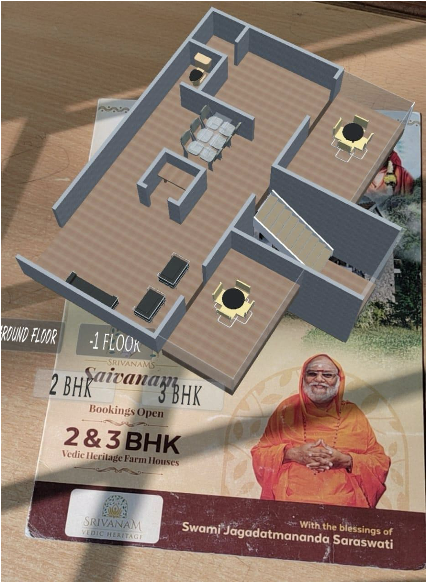
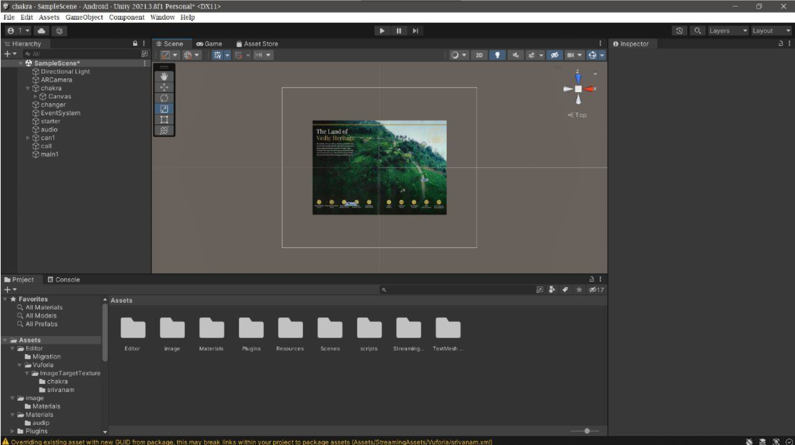
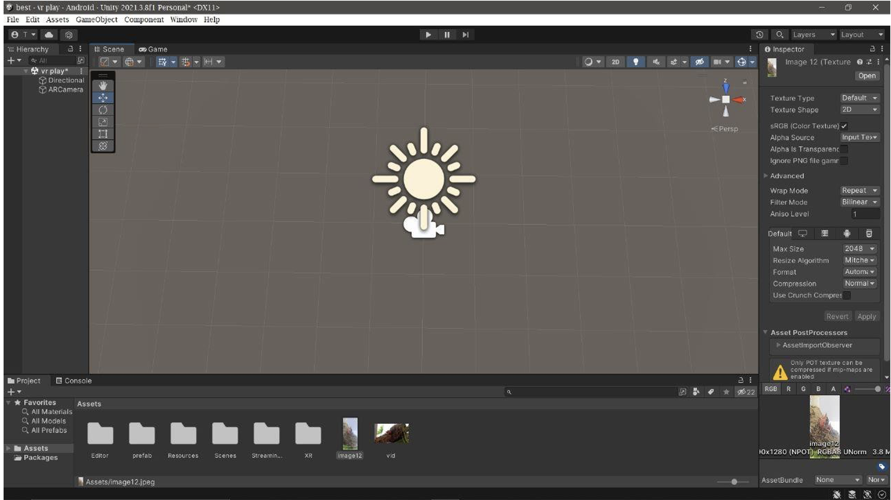

#  AR-Based E-Brochure – Unity + Vuforia + ML (Client: SriVanam Vedic Heritage)

This project transformed a traditional real estate brochure into a fully immersive **AR experience**, built using Unity and enhanced with a custom ML pipeline for 3D reconstruction. Developed during my internship at Gramophone Media Lab when I was just **18 years old**, this solution was pitched by me and adopted by the company — resulting in **₹1.6 lakh (~$2,000 USD)** revenue in its first month.

---

## Project Highlights

-  **Intern-Led Innovation**: Proposed and delivered at age 18 during internship.
-  **Business Impact**: Helped close multiple leads with AR-based marketing.
-  **ML-Powered 3D Mapping**: Used a 2022-era multi-view ML model to generate **3D terrain** of the property’s hill location.
-  **Unity + Vuforia Engineering**: Built full image tracking + prefab visualization system.
-  **Complete AR Demo**: Interactive villa model, map route, terrain visuals—all on Android.

---

## 🛠 Tech Stack

- Unity (2021.x)
- Vuforia SDK
- Blender (minor edits)
- C#
- Python (ML model for 3D from multi-view images)
- Android SDK

---

##  Project Demo (Screenshots)

All images used below are compressed versions of original demo content.

---

### 📄 1. Traditional Brochure (Before AR)

| Front View               | Brochure Inside           |
|--------------------------|---------------------------|
|       |        |

| Back View           |
|---------------------------|
|    |
---

###  2. AR Experience Output (Live App Preview)

| AR Villa View            | Route Map in AR            |
|--------------------------|--------------------------- |
|   |     |
|   | 
                           
| Aerial Overview           |
|---------------------------|
|    |
---

###  3. Unity Project Internals

| Unity Scene              | AR Camera Config          |
|--------------------------|---------------------------|
|    |      |
|    |                           |

##  Disclaimer

This project was built in 2021–2022 and may not run on newer Unity versions.  
Shared for portfolio and demo purposes.

---

##  Credits

- **Client:** SriVanam Vedic Heritage
- **Company:** Gramophone Media Lab
- **Mentors:** Muhundhan Gopal, Jai Decosta

---

## 🧬 Why This Still Matters

Though I now focus on **AI/ML**, this project reflects:
- Real-world product thinking at a young age
- Hands-on innovation from ideation to deployment
- Creative integration of spatial computing and machine learning

> 📌 Built from scratch. Proposed at 18. Delivered with impact.